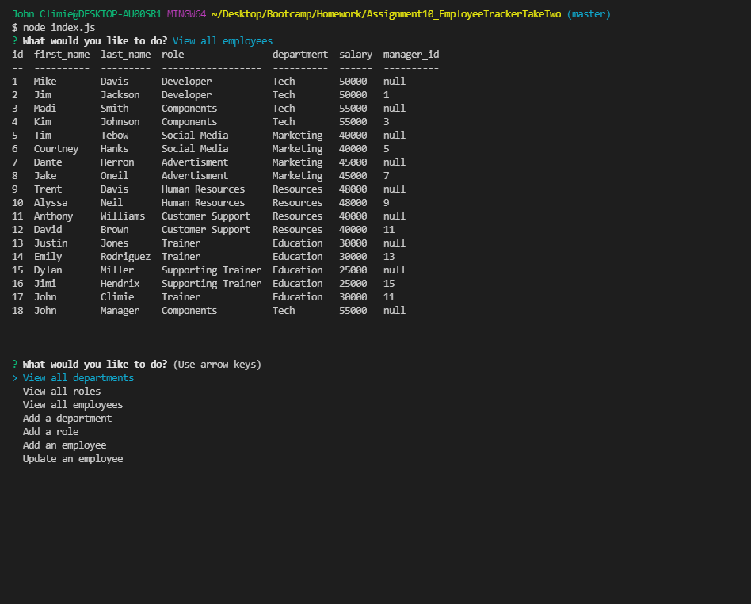

# Employee Tracker

## Description

In this project, I created an employee tracker froms scratch. This project takes user input from the user with the CLI. This input is stored into a SQL Database.

The user is prompted with options to view all departments, view all roles, view all employees, add a department, add a role, add an employee, and finally, they can update an employee by updating their role. The prompt goes as long as the user desires.

I created this project using Javascript, Node.js and SQL. This project was created completely from a blank slate. I also used a few NPMs, such as Inquirer for asking questions, mysql2 so my project can interact with the SQL database, and console.table, which logged my results in a neatly formatted table in the command-line interface.

This project was different from everything else, as I had to use a brand new language and conecept of back-end development. It was difficult, as I had to restart the entire project due to my last attempt resulting in errors in every little changed, therefore I started this one with a better approach.

**Link**

YouTube Demonstration: https://www.youtube.com/watch?v=wsxBMa0JqQ0